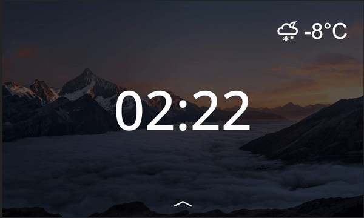

# Lock Screen concept for any smart-home web ui



## Installation
- Clone repository
- Install node v18+
- In root of repository run `./install.sh`
- Reboot system

> Note: After change src/config.ts you need to reboot system or rebuild project

## Configuration

```ts
import example from './assets/example.jpg';
import example1 from '...';
import example2 from '...';

export default {
  // hour 0 - 23
  0: {
    image: example, // imported image
    clockColor: '#fff',     // color of clock
    brightness: 0.4, // brightness of background 0 -> 1
    // grayscale: true, // enable grayscale filter
    font: {
      family: "'Open Sans'", // font family ( default: Roboto )
      size: '15vw',
      weight: 500
    }
  },
  10: {
    image: example1,
    // ...
  },
  23: {
    image: example2,
    // ...
  },
} as BackgroundMapping;

type LockConfig = {
  lock: string;
  iframeSrc: string;
  // blank: string | null;
};
export const lockConfig: LockConfig = {
  lock: '10m', // time before screen locked
  // blank: '10m',
  iframeSrc: 'http://spruthub.local' // url for your smart home ui ( default - localhost:80 )
};
```

In example screensaver automatically change background at `10:00` to `example1`, at `23:00` to `example2` and at `00:00` to `example`