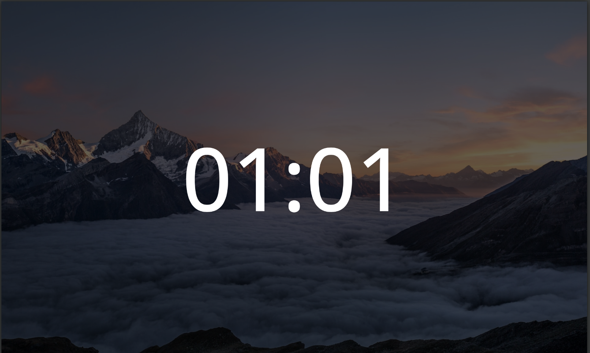

# Clock Web-ScreenSaver



## Installation
- Install and configure [webscreensaver](https://github.com/lmartinking/webscreensaver)
- Clone repository
- Install deps and build `yarn && yarn build`
- Edit `~/.xscreensaver` file, add `-url file://<folder where cloned repo>/dist/index.html` to line with `webscreensaver`
- Reboot system

## Configuration

Open `./src/config.ts` file
Here is example:

```ts
import example from './assets/example.jpg';
import example1 from '...';
import example2 from '...';

export default {
  // hour 0 - 23
  0: {
    image: example, // imported image
    clockColor: '#fff',     // color of clock
    brightness: 0.4, // brightness of background 0 -> 1
    // grayscale: true, // enable grayscale filter
    font: {
      family: "'Open Sans'", // font family ( default: Roboto )
      size: '15vw',
      weight: 500
    }
  },
  10: {
    image: example1,
    // ...
  },
  23: {
    image: example2,
    // ...
  },
} as BackgroundMapping;
```

In example screensaver automatically change background at `10:00` to `example1`, at `23:00` to `example2` and at `00:00` to `example`